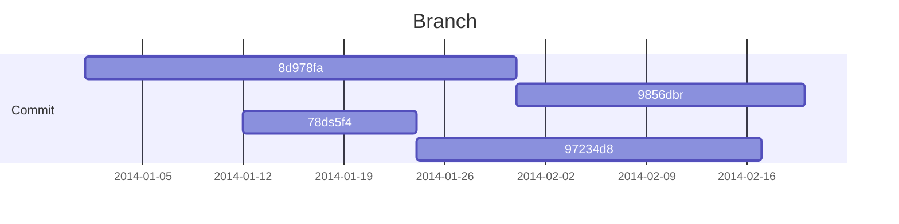
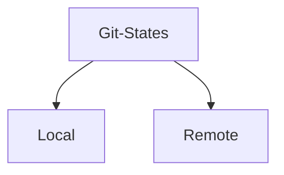
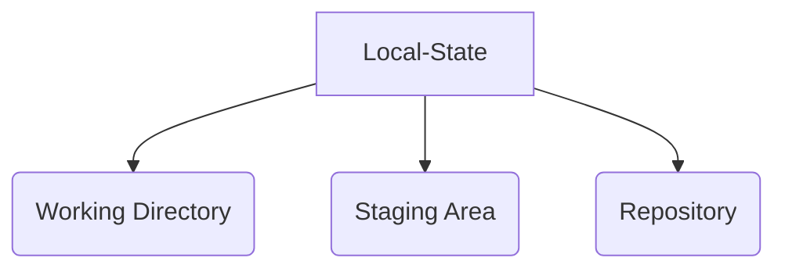

# Introduction

## Objective
+ Git: Solid Understanding
+ GitHub Hosting Service

## Git Core Concepts
+ Installation
+ Git Basics
+ Git Advance
+ GitHub
+ Gists
+ Issue Tracking
+ Grouping repositories into organizations

# Disclaimer

Don't read this documentation passively. Digests the concepts properly.
> 📈 Less is more.

# TL;DR

```bash
git code .                                //Open vs code
git status                                //Show file status
git status -s                             //show short file status
git add <filename>                        //Add the particular file to staging area
git add .                                  //Add all the file to the staging area
git commit --amend                        //Add these changes to the last commit (will have to use vim editor)
git commit -m "message"                   //Commit the files in the staging area    
git commit -am "message"                  //Will commit without adding the file to the staging area
git checkout --<filename>                 //will restore the file from the last commit
git checkout -f                           //All the files will be replaced with last commit
git checkout -b <branch name> 		   	  //Create a branch
git branch 								//To see the branches
git branch -d <branch name>				//To delete a branch
git branch -v 							//will show the branch and its last commit
git branch --merged 					//will show the branches that are merged
git branch --no-merged 					//will show the branches that are not merged
git merge <branch name>					//while in a branch you can merge another branch
git log                                   //Show all the commits
git log -n                                //n can be replaced by any number "will show last n commits"
git log -p                                //Will show detailed discription of the commits  
git log -p -n                             //use of n is similar as described above  
git log --stat                            //will show short detailing of the commits  
git log --stat -n                         //use of n is similar as described above    
git log --since=n.days                    //commit of last n days/weeks/months "days can be replaced by weeks,months"
git rm --cached <filename>                //will remove to file from the tracking area 
git rm -rf                                //will uninitialized the current repository              
git rm <filename>                         //will delete the file  
git mv <Present filename> <The filename after the change>  //to Rename the file
git clone <URL>                           //Cloning a repository in the current folder
git clone <URL> foldername                //Cloning the repository in the given folder name (Folder will be created by itself) 
git config --global alias. <new name> 'old command'  //while create an alias command for the given command
git remote 						//Show all the name of remote repository
git remote -v 					//Show all the path (fetch/push) of the remote repository
git remote add <name> url			//Add a remote repository
git remote rm <name>				//To remove a remote
git push <remote name> <branch name>	//To push a branch to remote repository
git push <remote name> <branch name>:<branch name you want to have in the remote repository>
git reset HEAD						//To move to a previous commit


More commands can be found on this website
//website https://git-scm.com/docs/git-log
```

# Command Line

Using the `command line interface` helps to unlock git's raw potential. CLI is the common communication among developers from decades. New features are always available first to the CLI.

# Core Concepts

## What is Git?

Git is a decentralized or distributed version control system. Only few features required internet connection, thus we can work offline without any hesitation. It is a `free`, `multi-platform`, `open-source` software and had wide adoption/integration into other tools used by the software developers. It has vibrant community.

## The Repository

The collection of version controlled files being managed their history is considered as the repository.
`.git` is a hidden file within the repository which has his own collection of files & folders that makes at the internal structure of the repository. As it contains all the history of files and folders, thus we have to keep git repositories as narrow focused as possible.

## Commits & Files

Git works by saving the current state of all its files it manages into a snapshot called commit. Commits are saved in timeline or branch. Every repository has at least one branch called `master`. We can create number of branches as per our requirements.



## What is GitHub?

GitHub is the most popular git repository hosting service online. We can create `n` numbers of public repositories. Even source code of `git` is itself hosted on GitHub.

# Quick Installation

## Linux

```bash
sudo apt install git
```

## Windows

+ Download installer from git's official [website](https://git-scm.com/downloads).

## MAC

```bash
brew update
brew install git
```

## Minimal Configuration
`OS Independent 🌴`

In **Git Bash**:
```bash
git config --global user.name "yourUserName"
git config --global user.email "your@email.com" 
```

## Notepad Configuration

```bash
notepad ~/.bash_profile
```

Now, add a line in the file

```bash
alias np='notepad -multiInst -nosession'
```

Now make Notepad as git's default editor

```bash
git config --global core.editor 'notepad -multiInst -nosession'
```

Test the git integration

```bash
git config --global -e
```

Now download `p4merge`

+ The site is constantly changing, hence the exact path of [`p4merge`](perforce.com)  may change time to time.
+ Select your operating system and install it accordingly.
+ Now open setup and install only `p4merge` and dis-select all other items.

Integrated `p4merge` with `git`

+ Find the path of `perforce`.

```bash
git config --global diff.tool p4merge
git config --global difftool.p4merge.path "C:\ProgramFiles\Perforce\p4merge.exe"
git config --global difftool.prompt false
git config --global merge.tool p4merge
git config --global mergetool.p4merge.path "C:/Program Files/Perforce/p4merge.exe"
git config --global mergetool.prompt false
```

# The Basics

## Overview

+ Repository Creation
+ Basic Workflow
+ File Operations
+ Transient files
+ Undo Mistakes

## Initialization

Creating a git repository

```bash
pwd # To find parent working directory
ls -a # To see all the hidden and non-hidden files
mkdir git-training # To make a new folder name "git-training"
git init demo # To initialized new git repository name "demo"
cd demo # To navigate inside the git repository
```

## Git States



Now, Local State:


+ **Working Directory**: It contains all the files and folder for your applications, which may or may not be managed by git. Although, Git is aware of those files.
+ **Staging Area**: It used to prepare for the next commit. Files are modified to working directory state to the git staging area, and then finally committed into the git repository.
+ **Repository (.git folder)**: Git repository or `commit history` which contains all the committed or saved changes to the git repository. Anything here, is a part of `git history`. 


+ **Remote State**: It is just another repository with its own three states internally.

## First Commit

```bash
dhana@DhananjayPorwal MINGW64 ~/OneDrive/Desktop/git-training/demo (master)
$ git status # For checking git status
On branch master

No commits yet

nothing to commit (create/copy files and use "git add" to track)

dhana@DhananjayPorwal MINGW64 ~/OneDrive/Desktop/git-training/demo (master)
$ notepad README.md # Create README.md file and open it in notepad

dhana@DhananjayPorwal MINGW64 ~/OneDrive/Desktop/git-training/demo (master)
$ ls # List files
README.md

dhana@DhananjayPorwal MINGW64 ~/OneDrive/Desktop/git-training/demo (master)
$ git status
On branch master

No commits yet

Untracked files:
  (use "git add <file>..." to include in what will be committed)
        README.md

nothing added to commit but untracked files present (use "git add" to track)

dhana@DhananjayPorwal MINGW64 ~/OneDrive/Desktop/git-training/demo (master)
$ git add README.md # Add README.md to staging area

dhana@DhananjayPorwal MINGW64 ~/OneDrive/Desktop/git-training/demo (master)
$ git status
On branch master

No commits yet

Changes to be committed:
  (use "git rm --cached <file>..." to unstage)
        new file:   README.md


dhana@DhananjayPorwal MINGW64 ~/OneDrive/Desktop/git-training/demo (master)
$ git commit -m "This is commit message" # Commit change into repository
[master (root-commit) 6e61414] This is commit message
 1 file changed, 3 insertions(+)
 create mode 100644 README.md

dhana@DhananjayPorwal MINGW64 ~/OneDrive/Desktop/git-training/demo (master)
$ git status
On branch master
nothing to commit, working tree clean
```

## Repository & Git Folder

```bash
dhana@DhananjayPorwal MINGW64 ~/OneDrive/Desktop/git-training/demo (master)
$ ls -al
total 5
drwxr-xr-x 1 dhana 197609  0 Oct  4 18:55 ./
drwxr-xr-x 1 dhana 197609  0 Oct  4 18:34 ../
drwxr-xr-x 1 dhana 197609  0 Oct  4 18:57 .git/
-rw-r--r-- 1 dhana 197609 53 Oct  4 18:55 README.md

dhana@DhananjayPorwal MINGW64 ~/OneDrive/Desktop/git-training/demo (master)
$ cd .git/

dhana@DhananjayPorwal MINGW64 ~/OneDrive/Desktop/git-training/demo/.git (GIT_DIR!)
$ ls -a
./  ../  COMMIT_EDITMSG  HEAD  config  description  hooks/  index  info/  logs/  objects/  refs/

dhana@DhananjayPorwal MINGW64 ~/OneDrive/Desktop/git-training/demo/.git (GIT_DIR!)
$ cd ..

dhana@DhananjayPorwal MINGW64 ~/OneDrive/Desktop/git-training/demo (master)
$ rm -rf .git/ # Remove .git folder recursively 

dhana@DhananjayPorwal MINGW64 ~/OneDrive/Desktop/git-training/demo
$ ls -a
./  ../  README.md

dhana@DhananjayPorwal MINGW64 ~/OneDrive/Desktop/git-training/demo
$ git status
fatal: not a git repository (or any of the parent directories): .git
```

## Starting with Existing Project

```bash
dhana@DhananjayPorwal MINGW64 ~/OneDrive/Desktop/git-training/demo
$ ls -la
total 1
drwxr-xr-x 1 dhana 197609  0 Oct  4 19:00 ./
drwxr-xr-x 1 dhana 197609  0 Oct  4 18:34 ../
-rw-r--r-- 1 dhana 197609 53 Oct  4 18:55 README.md

dhana@DhananjayPorwal MINGW64 ~/OneDrive/Desktop/git-training/demo
$ git init . # Here, (.) is used to initalize git in current folder
Initialized empty Git repository in C:/Users/dhana/OneDrive/Desktop/git-training/demo/.git/

dhana@DhananjayPorwal MINGW64 ~/OneDrive/Desktop/git-training/demo (master)
$ git status
On branch master

No commits yet

Untracked files:
  (use "git add <file>..." to include in what will be committed)
        README.md

nothing added to commit but untracked files present (use "git add" to track)
```

## Commits and Messages

```bash
dhana@DhananjayPorwal MINGW64 ~/OneDrive/Desktop/git-training/demo (master)
$ notepad LICENSE.md

dhana@DhananjayPorwal MINGW64 ~/OneDrive/Desktop/git-training/demo (master)
$ git status
On branch master

No commits yet

Untracked files:
  (use "git add <file>..." to include in what will be committed)
        LICENSE.md
        README.md

nothing added to commit but untracked files present (use "git add" to track)

dhana@DhananjayPorwal MINGW64 ~/OneDrive/Desktop/git-training/demo (master)
$ git add . # Add all the files to repository

dhana@DhananjayPorwal MINGW64 ~/OneDrive/Desktop/git-training/demo (master)
$ git status
On branch master

No commits yet

Changes to be committed:
  (use "git rm --cached <file>..." to unstage)
        new file:   LICENSE.md
        new file:   README.md

dhana@DhananjayPorwal MINGW64 ~/OneDrive/Desktop/git-training/demo (master)
$ git commit -m "Testing Commit"
[master (root-commit) a8509b4] Testing Commit
 2 files changed, 6 insertions(+)
 create mode 100644 LICENSE.md
 create mode 100644 README.md
```

## Commit Details with Log and Show

```bash
dhana@DhananjayPorwal MINGW64 ~/OneDrive/Desktop/git-training/demo (master)
$ pwd
/c/Users/dhana/OneDrive/Desktop/git-training/demo

dhana@DhananjayPorwal MINGW64 ~/OneDrive/Desktop/git-training/demo (master)
$ git status
On branch master
nothing to commit, working tree clean

dhana@DhananjayPorwal MINGW64 ~/OneDrive/Desktop/git-training/demo (master)
$ git log
commit a8509b4dd75d0da90d8b06b385c72e81e06f5b83 (HEAD -> master) # SHA-1 Identifier which uniquely identify this commit
Author: DhananjayPorwal <dporwal985@gmail.com>
Date:   Fri Oct 7 12:54:55 2022 +0530

    Testing Commit # Commit Message

dhana@DhananjayPorwal MINGW64 ~/OneDrive/Desktop/git-training/demo (master)
$ git show
commit a8509b4dd75d0da90d8b06b385c72e81e06f5b83 (HEAD -> master)
Author: DhananjayPorwal <dporwal985@gmail.com>
Date:   Fri Oct 7 12:54:55 2022 +0530

    Testing Commit

diff --git a/LICENSE.md b/LICENSE.md
new file mode 100644
index 0000000..50d987e
--- /dev/null
+++ b/LICENSE.md
@@ -0,0 +1,3 @@
+# License
+
+## Apache 2.0
\ No newline at end of file
diff --git a/README.md b/README.md
new file mode 100644
index 0000000..09257f3
--- /dev/null
+++ b/README.md
@@ -0,0 +1,3 @@
+# Demo Project README
```

## Express Commits

```bash
dhana@DhananjayPorwal MINGW64 ~/OneDrive/Desktop/git-training/demo (master)
$ git status
On branch master
nothing to commit, working tree clean

dhana@DhananjayPorwal MINGW64 ~/OneDrive/Desktop/git-training/demo (master)
$ ls
LICENSE.md  README.md

dhana@DhananjayPorwal MINGW64 ~/OneDrive/Desktop/git-training/demo (master)
$ notepad README.md

dhana@DhananjayPorwal MINGW64 ~/OneDrive/Desktop/git-training/demo (master)
$ git status
On branch master
Changes not staged for commit:
  (use "git add <file>..." to update what will be committed)
  (use "git restore <file>..." to discard changes in working directory)
        modified:   README.md

no changes added to commit (use "git add" and/or "git commit -a")

dhana@DhananjayPorwal MINGW64 ~/OneDrive/Desktop/git-training/demo (master)
$ git ls-files # List all the files tracked by git
LICENSE.md
README.md

dhana@DhananjayPorwal MINGW64 ~/OneDrive/Desktop/git-training/demo (master)
$ touch new.file # Create new file 

dhana@DhananjayPorwal MINGW64 ~/OneDrive/Desktop/git-training/demo (master)
$ git status
On branch master
Changes not staged for commit:
  (use "git add <file>..." to update what will be committed)
  (use "git restore <file>..." to discard changes in working directory)
        modified:   README.md

Untracked files:
  (use "git add <file>..." to include in what will be committed)
        new.file

no changes added to commit (use "git add" and/or "git commit -a")

dhana@DhananjayPorwal MINGW64 ~/OneDrive/Desktop/git-training/demo (master)
$ git ls-files
LICENSE.md
README.md

dhana@DhananjayPorwal MINGW64 ~/OneDrive/Desktop/git-training/demo (master)
$ rm new.file

dhana@DhananjayPorwal MINGW64 ~/OneDrive/Desktop/git-training/demo (master)
$ git status
On branch master
Changes not staged for commit:
  (use "git add <file>..." to update what will be committed)
  (use "git restore <file>..." to discard changes in working directory)
        modified:   README.md

no changes added to commit (use "git add" and/or "git commit -a")

dhana@DhananjayPorwal MINGW64 ~/OneDrive/Desktop/git-training/demo (master)
$ git commit -am "Updating README" # -a = git add + git commit, m for commit message
[master cfd2523] Updating README
 1 file changed, 3 insertions(+), 1 deletion(-)

dhana@DhananjayPorwal MINGW64 ~/OneDrive/Desktop/git-training/demo (master)
$ git log
commit cfd2523b76d3b1b31e40e66273414a893627e3a2 (HEAD -> master)
Author: DhananjayPorwal <dporwal985@gmail.com>
Date:   Fri Oct 7 13:06:56 2022 +0530

    Updating README

commit a8509b4dd75d0da90d8b06b385c72e81e06f5b83
Author: DhananjayPorwal <dporwal985@gmail.com>
Date:   Fri Oct 7 12:54:55 2022 +0530

    Testing Commit
```

## Backing Out Changes

```bash
dhana@DhananjayPorwal MINGW64 ~/OneDrive/Desktop/git-training/demo (master)
$ git status
On branch master
nothing to commit, working tree clean

dhana@DhananjayPorwal MINGW64 ~/OneDrive/Desktop/git-training/demo (master)
$ notepad README.md # Open file and adding a line to it

dhana@DhananjayPorwal MINGW64 ~/OneDrive/Desktop/git-training/demo (master)
$ git status
On branch master
Changes not staged for commit:
  (use "git add <file>..." to update what will be committed)
  (use "git restore <file>..." to discard changes in working directory)
        modified:   README.md

no changes added to commit (use "git add" and/or "git commit -a")

dhana@DhananjayPorwal MINGW64 ~/OneDrive/Desktop/git-training/demo (master)
$ git add . # Adding changes into staging area

dhana@DhananjayPorwal MINGW64 ~/OneDrive/Desktop/git-training/demo (master)
$ git status
On branch master
Changes to be committed:
  (use "git restore --staged <file>..." to unstage)
        modified:   README.md


dhana@DhananjayPorwal MINGW64 ~/OneDrive/Desktop/git-training/demo (master)
$ git reset HEAD README.md # Reset last staging change of README file
Unstaged changes after reset:
M       README.md

dhana@DhananjayPorwal MINGW64 ~/OneDrive/Desktop/git-training/demo (master)
$ notepad README.md # Here out changes are still there

dhana@DhananjayPorwal MINGW64 ~/OneDrive/Desktop/git-training/demo (master)
$ git status
On branch master
Changes not staged for commit:
  (use "git add <file>..." to update what will be committed)
  (use "git restore <file>..." to discard changes in working directory)
        modified:   README.md

no changes added to commit (use "git add" and/or "git commit -a")

dhana@DhananjayPorwal MINGW64 ~/OneDrive/Desktop/git-training/demo (master)
$ git checkout -- README.md # This will restore README file to its commit state

dhana@DhananjayPorwal MINGW64 ~/OneDrive/Desktop/git-training/demo (master)
$ git status
On branch master
nothing to commit, working tree clean

dhana@DhananjayPorwal MINGW64 ~/OneDrive/Desktop/git-training/demo (master)
$ notepad README.md # Changes are gone
```

## History and Making New Commands with Alias

```bash
dhana@DhananjayPorwal MINGW64 ~/OneDrive/Desktop/git-training/demo (master)
$ git status
On branch master
nothing to commit, working tree clean

dhana@DhananjayPorwal MINGW64 ~/OneDrive/Desktop/git-training/demo (master)
$ git log
commit cfd2523b76d3b1b31e40e66273414a893627e3a2 (HEAD -> master)
Author: DhananjayPorwal <dporwal985@gmail.com>
Date:   Fri Oct 7 13:06:56 2022 +0530

    Updating README

commit a8509b4dd75d0da90d8b06b385c72e81e06f5b83
Author: DhananjayPorwal <dporwal985@gmail.com>
Date:   Fri Oct 7 12:54:55 2022 +0530

    Testing Commit

dhana@DhananjayPorwal MINGW64 ~/OneDrive/Desktop/git-training/demo (master)
$ git help log # (file:///C:/Program%20Files/Git/mingw64/share/doc/git-doc/git-log.html)

dhana@DhananjayPorwal MINGW64 ~/OneDrive/Desktop/git-training/demo (master)
$ git log --oneline --graph --decorate --all # oneline: oneline summary of particular commit, graph: asterisk based graph of branching, decorate: which commit is part of which branches, all: for all files
* cfd2523 (HEAD -> master) Updating README
* a8509b4 Testing Commit

dhana@DhananjayPorwal MINGW64 ~/OneDrive/Desktop/git-training/demo (master)
$ git config --global alias.hist "log --oneline --graph --decorate --all" # Making a hist command for all the user, result we don't need to write "log --oneline..." again and again

dhana@DhananjayPorwal MINGW64 ~/OneDrive/Desktop/git-training/demo (master)
$ git config --global --list # List all the git global configurations
user.name=DhananjayPorwal
user.email=dporwal985@gmail.com
filter.lfs.required=true
filter.lfs.clean=git-lfs clean -- %f
filter.lfs.smudge=git-lfs smudge -- %f
filter.lfs.process=git-lfs filter-process
core.editor=notepad -multiInst -nosession
diff.tool=p4merge
difftool.p4merge.path=<U+0096>C:\Program Files\Perforce\p4merge.exe
difftool.prompt=false
merge.tool=p4merge
mergetool.p4merge.path=C:/Program Files/Perforce/p4merge.exe
mergetool.prompt=false
alias.hist=log --oneline --graph --decorate --all

dhana@DhananjayPorwal MINGW64 ~/OneDrive/Desktop/git-training/demo (master)
$ git hist
* cfd2523 (HEAD -> master) Updating README
* a8509b4 Testing Commit

dhana@DhananjayPorwal MINGW64 ~/OneDrive/Desktop/git-training/demo (master)
$ git hist -- LICENSE.md
* a8509b4 Testing Commit
```

## Rename and Delete Files

```bash
dhana@DhananjayPorwal MINGW64 ~/OneDrive/Desktop/git-training/demo (master)
$ git status
On branch master
nothing to commit, working tree clean

dhana@DhananjayPorwal MINGW64 ~/OneDrive/Desktop/git-training/demo (master)
$ touch example.txt # Create a file

dhana@DhananjayPorwal MINGW64 ~/OneDrive/Desktop/git-training/demo (master)
$ git status
On branch master
Untracked files:
  (use "git add <file>..." to include in what will be committed)
        example.txt

nothing added to commit but untracked files present (use "git add" to track)

dhana@DhananjayPorwal MINGW64 ~/OneDrive/Desktop/git-training/demo (master)
$ git add example.txt # Add file to staging area

dhana@DhananjayPorwal MINGW64 ~/OneDrive/Desktop/git-training/demo (master)
$ git commit -m "adding example file" # Commit file
[master e1a3c8f] adding example file
 1 file changed, 0 insertions(+), 0 deletions(-)
 create mode 100644 example.txt

dhana@DhananjayPorwal MINGW64 ~/OneDrive/Desktop/git-training/demo (master)
$ ls -la
total 6
drwxr-xr-x 1 dhana 197609  0 Oct  7 20:52 ./
drwxr-xr-x 1 dhana 197609  0 Oct  4 18:34 ../
drwxr-xr-x 1 dhana 197609  0 Oct  7 20:52 .git/
-rw-r--r-- 1 dhana 197609 26 Oct  7 12:53 LICENSE.md
-rw-r--r-- 1 dhana 197609 69 Oct  7 15:40 README.md
-rw-r--r-- 1 dhana 197609  0 Oct  7 20:52 example.txt

dhana@DhananjayPorwal MINGW64 ~/OneDrive/Desktop/git-training/demo (master)
$ git mv example.txt demo.txt # Rename file using git utility

dhana@DhananjayPorwal MINGW64 ~/OneDrive/Desktop/git-training/demo (master)
$ git status
On branch master
Changes to be committed:
  (use "git restore --staged <file>..." to unstage)
        renamed:    example.txt -> demo.txt


dhana@DhananjayPorwal MINGW64 ~/OneDrive/Desktop/git-training/demo (master)
$ ls -la
total 6
drwxr-xr-x 1 dhana 197609  0 Oct  7 20:53 ./
drwxr-xr-x 1 dhana 197609  0 Oct  4 18:34 ../
drwxr-xr-x 1 dhana 197609  0 Oct  7 20:53 .git/
-rw-r--r-- 1 dhana 197609 26 Oct  7 12:53 LICENSE.md
-rw-r--r-- 1 dhana 197609 69 Oct  7 15:40 README.md
-rw-r--r-- 1 dhana 197609  0 Oct  7 20:52 demo.txt

dhana@DhananjayPorwal MINGW64 ~/OneDrive/Desktop/git-training/demo (master)
$ git commit -m "renaming example"
[master a52098e] renaming example
 1 file changed, 0 insertions(+), 0 deletions(-)
 rename example.txt => demo.txt (100%) # This percentage shows difference between the files

dhana@DhananjayPorwal MINGW64 ~/OneDrive/Desktop/git-training/demo (master)
$ ls -la
total 6
drwxr-xr-x 1 dhana 197609  0 Oct  7 20:53 ./
drwxr-xr-x 1 dhana 197609  0 Oct  4 18:34 ../
drwxr-xr-x 1 dhana 197609  0 Oct  7 20:53 .git/
-rw-r--r-- 1 dhana 197609 26 Oct  7 12:53 LICENSE.md
-rw-r--r-- 1 dhana 197609 69 Oct  7 15:40 README.md
-rw-r--r-- 1 dhana 197609  0 Oct  7 20:52 demo.txt

dhana@DhananjayPorwal MINGW64 ~/OneDrive/Desktop/git-training/demo (master)
$ git rm demo.txt # Delete file using git utility
rm 'demo.txt'

dhana@DhananjayPorwal MINGW64 ~/OneDrive/Desktop/git-training/demo (master)
$ git status
On branch master
Changes to be committed:
  (use "git restore --staged <file>..." to unstage)
        deleted:    demo.txt


dhana@DhananjayPorwal MINGW64 ~/OneDrive/Desktop/git-training/demo (master)
$ ls -la
total 6
drwxr-xr-x 1 dhana 197609  0 Oct  7 20:54 ./
drwxr-xr-x 1 dhana 197609  0 Oct  4 18:34 ../
drwxr-xr-x 1 dhana 197609  0 Oct  7 20:54 .git/
-rw-r--r-- 1 dhana 197609 26 Oct  7 12:53 LICENSE.md
-rw-r--r-- 1 dhana 197609 69 Oct  7 15:40 README.md

dhana@DhananjayPorwal MINGW64 ~/OneDrive/Desktop/git-training/demo (master)
$ git status
On branch master
Changes to be committed:
  (use "git restore --staged <file>..." to unstage)
        deleted:    demo.txt


dhana@DhananjayPorwal MINGW64 ~/OneDrive/Desktop/git-training/demo (master)
$ git commit -m "deleting demo file"
[master 5ebb6f3] deleting demo file
 1 file changed, 0 insertions(+), 0 deletions(-)
 delete mode 100644 demo.txt

dhana@DhananjayPorwal MINGW64 ~/OneDrive/Desktop/git-training/demo (master)
$ git status
On branch master
nothing to commit, working tree clean
```

## Managing Files Outside of Git

```bash
dhana@DhananjayPorwal MINGW64 ~/OneDrive/Desktop/git-training/demo (master)
$ ls
LICENSE.md  README.md

dhana@DhananjayPorwal MINGW64 ~/OneDrive/Desktop/git-training/demo (master)
$ touch myfile.txt

dhana@DhananjayPorwal MINGW64 ~/OneDrive/Desktop/git-training/demo (master)
$ ls
LICENSE.md  README.md  myfile.txt

dhana@DhananjayPorwal MINGW64 ~/OneDrive/Desktop/git-training/demo (master)
$ mv LICENSE.md LICENSE.txt # Renameing files at operation utility

dhana@DhananjayPorwal MINGW64 ~/OneDrive/Desktop/git-training/demo (master)
$ ls -la
total 6
drwxr-xr-x 1 dhana 197609  0 Oct  7 20:58 ./
drwxr-xr-x 1 dhana 197609  0 Oct  4 18:34 ../
drwxr-xr-x 1 dhana 197609  0 Oct  7 20:55 .git/
-rw-r--r-- 1 dhana 197609 26 Oct  7 12:53 LICENSE.txt
-rw-r--r-- 1 dhana 197609 69 Oct  7 15:40 README.md
-rw-r--r-- 1 dhana 197609  0 Oct  7 20:58 myfile.txt

dhana@DhananjayPorwal MINGW64 ~/OneDrive/Desktop/git-training/demo (master)
$ git status
On branch master
Changes not staged for commit:
  (use "git add/rm <file>..." to update what will be committed)
  (use "git restore <file>..." to discard changes in working directory)
        deleted:    LICENSE.md # git thinks that we delete this file and add LICENSE.txt file

Untracked files:
  (use "git add <file>..." to include in what will be committed)
        LICENSE.txt
        myfile.txt

no changes added to commit (use "git add" and/or "git commit -a")

dhana@DhananjayPorwal MINGW64 ~/OneDrive/Desktop/git-training/demo (master)
$ git add -u # -u: update

dhana@DhananjayPorwal MINGW64 ~/OneDrive/Desktop/git-training/demo (master)
$ git status
On branch master
Changes to be committed:
  (use "git restore --staged <file>..." to unstage)
        deleted:    LICENSE.md

Untracked files:
  (use "git add <file>..." to include in what will be committed)
        LICENSE.txt
        myfile.txt


dhana@DhananjayPorwal MINGW64 ~/OneDrive/Desktop/git-training/demo (master)
$ git add -A # -A: covers all types of modifications accordingly in git index

dhana@DhananjayPorwal MINGW64 ~/OneDrive/Desktop/git-training/demo (master)
$ git status
On branch master
Changes to be committed:
  (use "git restore --staged <file>..." to unstage)
        renamed:    LICENSE.md -> LICENSE.txt
        new file:   myfile.txt


dhana@DhananjayPorwal MINGW64 ~/OneDrive/Desktop/git-training/demo (master)
$ git commit -m "rename and add"
[master c1ed2d8] rename and add
 2 files changed, 0 insertions(+), 0 deletions(-)
 rename LICENSE.md => LICENSE.txt (100%)
 create mode 100644 myfile.txt

dhana@DhananjayPorwal MINGW64 ~/OneDrive/Desktop/git-training/demo (master)
$ ls -la
total 6
drwxr-xr-x 1 dhana 197609  0 Oct  7 20:58 ./
drwxr-xr-x 1 dhana 197609  0 Oct  4 18:34 ../
drwxr-xr-x 1 dhana 197609  0 Oct  7 21:00 .git/
-rw-r--r-- 1 dhana 197609 26 Oct  7 12:53 LICENSE.txt
-rw-r--r-- 1 dhana 197609 69 Oct  7 15:40 README.md
-rw-r--r-- 1 dhana 197609  0 Oct  7 20:58 myfile.txt

dhana@DhananjayPorwal MINGW64 ~/OneDrive/Desktop/git-training/demo (master)
$ rm myfile.txt

dhana@DhananjayPorwal MINGW64 ~/OneDrive/Desktop/git-training/demo (master)
$ git status
On branch master
Changes not staged for commit:
  (use "git add/rm <file>..." to update what will be committed)
  (use "git restore <file>..." to discard changes in working directory)
        deleted:    myfile.txt

no changes added to commit (use "git add" and/or "git commit -a")

dhana@DhananjayPorwal MINGW64 ~/OneDrive/Desktop/git-training/demo (master)
$ git add -u

dhana@DhananjayPorwal MINGW64 ~/OneDrive/Desktop/git-training/demo (master)
$ git status
On branch master
Changes to be committed:
  (use "git restore --staged <file>..." to unstage)
        deleted:    myfile.txt


dhana@DhananjayPorwal MINGW64 ~/OneDrive/Desktop/git-training/demo (master)
$ git commit -m "remove myfile.txt"
[master 0e23221] remove myfile.txt
 1 file changed, 0 insertions(+), 0 deletions(-)
 delete mode 100644 myfile.txt
```

## Excluding Unwanted Files

```bash
dhana@DhananjayPorwal MINGW64 ~/OneDrive/Desktop/git-training/demo (master)
$ ls -la
total 6
drwxr-xr-x 1 dhana 197609  0 Oct  7 21:00 ./
drwxr-xr-x 1 dhana 197609  0 Oct  4 18:34 ../
drwxr-xr-x 1 dhana 197609  0 Oct  7 21:01 .git/
-rw-r--r-- 1 dhana 197609 26 Oct  7 12:53 LICENSE.txt
-rw-r--r-- 1 dhana 197609 69 Oct  7 15:40 README.md

dhana@DhananjayPorwal MINGW64 ~/OneDrive/Desktop/git-training/demo (master)
$ notepad application.log # New file creation

dhana@DhananjayPorwal MINGW64 ~/OneDrive/Desktop/git-training/demo (master)
$ cat application.log # cat: concatinate, used to display data of files
Something awesome happened
Something bad happened
Something really bad happened
dhana@DhananjayPorwal MINGW64 ~/OneDrive/Desktop/git-training/demo (master)
$ git status
On branch master
Untracked files:
  (use "git add <file>..." to include in what will be committed)
        application.log

nothing added to commit but untracked files present (use "git add" to track)

dhana@DhananjayPorwal MINGW64 ~/OneDrive/Desktop/git-training/demo (master)
$ notepad .gitignore # create .gitignore file to ignore specific file

dhana@DhananjayPorwal MINGW64 ~/OneDrive/Desktop/git-training/demo (master)
$ cat .gitignore
*.log
# application.log can ignore only one file
# *.log can ignore all files which extension is .log

dhana@DhananjayPorwal MINGW64 ~/OneDrive/Desktop/git-training/demo (master)
$ git status
On branch master
Untracked files:
  (use "git add <file>..." to include in what will be committed)
        .gitignore

nothing added to commit but untracked files present (use "git add" to track)

dhana@DhananjayPorwal MINGW64 ~/OneDrive/Desktop/git-training/demo (master)
$ git add  .gitignore

dhana@DhananjayPorwal MINGW64 ~/OneDrive/Desktop/git-training/demo (master)
$ git commit -m "adding ,gitignore file"
[master ffbdcd0] adding ,gitignore file
 1 file changed, 3 insertions(+)
 create mode 100644 .gitignore

dhana@DhananjayPorwal MINGW64 ~/OneDrive/Desktop/git-training/demo (master)
$ git status
On branch master
nothing to commit, working tree clean
```


# Advance Beyond the Basics

## Advance Overview
+ Compare Differences
+ Branching, Merging and Conflict Resolution
+ Milestones
+ Work in Progress
+ Time Travel

## Comparing Differences

```bash
dhana@DhananjayPorwal MINGW64 ~/OneDrive/Desktop/git-training/demo (master)
$ git hist
* ffbdcd0 (HEAD -> master) adding ,gitignore file
* 0e23221 remove myfile.txt
* c1ed2d8 rename and add
* 5ebb6f3 deleting demo file
* a52098e renaming example
* e1a3c8f adding example file
* cfd2523 Updating README
* a8509b4 Testing Commit

dhana@DhananjayPorwal MINGW64 ~/OneDrive/Desktop/git-training/demo (master)
$ git diff cfd2523 HEAD # `diff` helps to compare commits, currently we are comparing last two commits
diff --git a/.gitignore b/.gitignore
new file mode 100644
index 0000000..298543e
--- /dev/null
+++ b/.gitignore
@@ -0,0 +1,3 @@
+*.log
+# application.log can ignore only one file
+# *.log can ignore all files which extension is .log
\ No newline at end of file
diff --git a/LICENSE.md b/LICENSE.txt
similarity index 100%
rename from LICENSE.md
rename to LICENSE.txt

dhana@DhananjayPorwal MINGW64 ~/OneDrive/Desktop/git-training/demo (master)
$ git difftool cfd2523 HEAD # Launch p4merge tool, & visually shows the differences

dhana@DhananjayPorwal MINGW64 ~/OneDrive/Desktop/git-training/demo (master)
$ notepad README.md

dhana@DhananjayPorwal MINGW64 ~/OneDrive/Desktop/git-training/demo (master)
$ git status
On branch master
Changes not staged for commit:
  (use "git add <file>..." to update what will be committed)
  (use "git restore <file>..." to discard changes in working directory)
        modified:   README.md

no changes added to commit (use "git add" and/or "git commit -a")

dhana@DhananjayPorwal MINGW64 ~/OneDrive/Desktop/git-training/demo (master)
$ git diff # Compare files
diff --git a/README.md b/README.md
index 8d61f68..18cf478 100644
--- a/README.md
+++ b/README.md
@@ -2,4 +2,5 @@

 This is a simple readme file

-## HEADING 2
\ No newline at end of file
+## HEADING 2
+cfd2523
\ No newline at end of file

dhana@DhananjayPorwal MINGW64 ~/OneDrive/Desktop/git-training/demo (master)
$ git difftool

dhana@DhananjayPorwal MINGW64 ~/OneDrive/Desktop/git-training/demo (master)
$ git help diff # (file:///C:/Program%20Files/Git/mingw64/share/doc/git-doc/git-diff.html)
```

## Branching and Merge Types

+ Branch Names are Labels
	+ Deletion Removes Label Only
$$Branch = TimelineOfCommits$$
> We can create and delete branches without affecting time lines.

By default we are working on `master branch`.


Types of Merges:
1. **Fast-Forward Merge**: This is most simplest merge, when no additional work has been detected  on the parent branch, or in our case called master branch.


> We can disable the `fast-forward-merge` if they show some undesired results.


2. **Automatic Merge**: Non-conflicting changes in the parent branch. Git is able to automatically resolves any conflicts. The old branch's timeline is preserved, and a new merge commit is created to show the merging of the two branches.


3. **Manual Merge**: This happens when git is unable to resolves any conflicts. Git enters a special conflicting merge state, which means that all merge conflicts must be resolved prior to moving forward with a commit. Once all conflicts have been resolved, those changes are saved as a merge commit.


## Special Markers

+ Pointers
> ***HEAD** is normally the last commit of the current branch*. As we switch the branches, the location of **HEAD** moves to match the last commit location of that branch. However, we can manually change the **HEAD**'s location someplace other than the last commit.

## Simple Branching Example

```bash
dhana@DhananjayPorwal MINGW64 ~/OneDrive/Desktop/git-training/demo (master)
$ git status
On branch master
Changes not staged for commit:
  (use "git add <file>..." to update what will be committed)
  (use "git restore <file>..." to discard changes in working directory)
        modified:   README.md

no changes added to commit (use "git add" and/or "git commit -a")

dhana@DhananjayPorwal MINGW64 ~/OneDrive/Desktop/git-training/demo (master)
$ git branch # Show all branches
* master

dhana@DhananjayPorwal MINGW64 ~/OneDrive/Desktop/git-training/demo (master)
$ git checkout -b updates # Create a new branch named 'updates'
Switched to a new branch 'updates'

dhana@DhananjayPorwal MINGW64 ~/OneDrive/Desktop/git-training/demo (updates)
$ git status
On branch updates
Changes not staged for commit:
  (use "git add <file>..." to update what will be committed)
  (use "git restore <file>..." to discard changes in working directory)
        modified:   README.md

no changes added to commit (use "git add" and/or "git commit -a")

dhana@DhananjayPorwal MINGW64 ~/OneDrive/Desktop/git-training/demo (updates)
$ notepad README.md

dhana@DhananjayPorwal MINGW64 ~/OneDrive/Desktop/git-training/demo (updates)
$ git add .

dhana@DhananjayPorwal MINGW64 ~/OneDrive/Desktop/git-training/demo (updates)
$ git commit -m "Adding updates from branch"
[updates bf44fc9] Adding updates from branch
 1 file changed, 3 insertions(+), 1 deletion(-)

dhana@DhananjayPorwal MINGW64 ~/OneDrive/Desktop/git-training/demo (updates)
$ git status
On branch updates
nothing to commit, working tree clean

dhana@DhananjayPorwal MINGW64 ~/OneDrive/Desktop/git-training/demo (updates)
$ git hist
* bf44fc9 (HEAD -> updates) Adding updates from branch # HEAD pointing to updates
* ffbdcd0 (master) adding ,gitignore file
* 0e23221 remove myfile.txt
* c1ed2d8 rename and add
* 5ebb6f3 deleting demo file
* a52098e renaming example
* e1a3c8f adding example file
* cfd2523 Updating README
* a8509b4 Testing Commit

dhana@DhananjayPorwal MINGW64 ~/OneDrive/Desktop/git-training/demo (updates)
$ git diff updates mastera # Show the difference between two branches
diff --git a/README.md b/README.md
index 84825e0..8d61f68 100644
--- a/README.md
+++ b/README.md
@@ -2,6 +2,4 @@

 This is a simple readme file

-## HEADING 2
-
-Just some updates, on a branch
\ No newline at end of file
+## HEADING 2
\ No newline at end of file

dhana@DhananjayPorwal MINGW64 ~/OneDrive/Desktop/git-training/demo (updates)
$ git checkout master # Branch changes to `master`
Switched to branch 'master'

dhana@DhananjayPorwal MINGW64 ~/OneDrive/Desktop/git-training/demo (master)
$ git hist
* bf44fc9 (updates) Adding updates from branch
* ffbdcd0 (HEAD -> master) adding ,gitignore file
* 0e23221 remove myfile.txt
* c1ed2d8 rename and add
* 5ebb6f3 deleting demo file
* a52098e renaming example
* e1a3c8f adding example file
* cfd2523 Updating README
* a8509b4 Testing Commit

dhana@DhananjayPorwal MINGW64 ~/OneDrive/Desktop/git-training/demo (master)
$ git merge updates # Merging branchs (updates --> master)
Updating ffbdcd0..bf44fc9
Fast-forward
 README.md | 4 +++-
 1 file changed, 3 insertions(+), 1 deletion(-)

dhana@DhananjayPorwal MINGW64 ~/OneDrive/Desktop/git-training/demo (master)
$ git hist
* bf44fc9 (HEAD -> master, updates) Adding updates from branch # master, update pointes to the same HEAD
* ffbdcd0 adding ,gitignore file
* 0e23221 remove myfile.txt
* c1ed2d8 rename and add
* 5ebb6f3 deleting demo file
* a52098e renaming example
* e1a3c8f adding example file
* cfd2523 Updating README
* a8509b4 Testing Commit

dhana@DhananjayPorwal MINGW64 ~/OneDrive/Desktop/git-training/demo (master)
$ git branch -d updates # Delete the 'updates' branch
Deleted branch updates (was bf44fc9).

dhana@DhananjayPorwal MINGW64 ~/OneDrive/Desktop/git-training/demo (master)
$ git hist
* bf44fc9 (HEAD -> master) Adding updates from branch
* ffbdcd0 adding ,gitignore file
* 0e23221 remove myfile.txt
* c1ed2d8 rename and add
* 5ebb6f3 deleting demo file
* a52098e renaming example
* e1a3c8f adding example file
* cfd2523 Updating README
* a8509b4 Testing Commit
```

## Conflicts Resolution

```bash
dhana@DhananjayPorwal MINGW64 ~/OneDrive/Desktop/git-training/demo (master)
$ git checkout -b 'very-bad'
Switched to a new branch 'very-bad'

dhana@DhananjayPorwal MINGW64 ~/OneDrive/Desktop/git-training/demo (very-bad)
$ git branch -a
  master
* very-bad

dhana@DhananjayPorwal MINGW64 ~/OneDrive/Desktop/git-training/demo (very-bad)
$ notepad README.md

dhana@DhananjayPorwal MINGW64 ~/OneDrive/Desktop/git-training/demo (very-bad)
$ git commit -am "very bad update"
[very-bad 4d57442] very bad update
 1 file changed, 1 insertion(+), 1 deletion(-)

dhana@DhananjayPorwal MINGW64 ~/OneDrive/Desktop/git-training/demo (very-bad)
$ git hist
* 4d57442 (HEAD -> very-bad) very bad update
* bf44fc9 (master) Adding updates from branch
* ffbdcd0 adding ,gitignore file
* 0e23221 remove myfile.txt
* c1ed2d8 rename and add
* 5ebb6f3 deleting demo file
* a52098e renaming example
* e1a3c8f adding example file
* cfd2523 Updating README
* a8509b4 Testing Commit

dhana@DhananjayPorwal MINGW64 ~/OneDrive/Desktop/git-training/demo (very-bad)
$ git checkout master
Switched to branch 'master'

dhana@DhananjayPorwal MINGW64 ~/OneDrive/Desktop/git-training/demo (master)
$ notepad README.md

dhana@DhananjayPorwal MINGW64 ~/OneDrive/Desktop/git-training/demo (master)
$ git commit -am "causing issues again"
[master 05c2ffc] causing issues again
 1 file changed, 1 insertion(+), 1 deletion(-)

dhana@DhananjayPorwal MINGW64 ~/OneDrive/Desktop/git-training/demo (master)
$ git branch -a
* master
  very-bad

dhana@DhananjayPorwal MINGW64 ~/OneDrive/Desktop/git-training/demo (master)
$ git merge very-bad
Auto-merging README.md
CONFLICT (content): Merge conflict in README.md
Automatic merge failed; fix conflicts and then commit the result.

dhana@DhananjayPorwal MINGW64 ~/OneDrive/Desktop/git-training/demo (master|MERGING)
$ cat README.md
# Demo Project README

This is a simple readme file

## HEADING 2

<<<<<<< HEAD
I hope this isn't much of a problem
=======
This is bound to cause trouble
>>>>>>> very-bad

dhana@DhananjayPorwal MINGW64 ~/OneDrive/Desktop/git-training/demo (master|MERGING)
$ git mergetool
Merging:
README.md

Normal merge conflict for 'README.md':
  {local}: modified file
  {remote}: modified file

dhana@DhananjayPorwal MINGW64 ~/OneDrive/Desktop/git-training/demo (master|MERGING)
$ cat README.md
# Demo Project README

This is a simple readme file

## HEADING 2

This is bound to cause trouble

dhana@DhananjayPorwal MINGW64 ~/OneDrive/Desktop/git-training/demo (master|MERGING)
$ git commit -m "Resolving conflict"
[master 28f2599] Resolving conflict

dhana@DhananjayPorwal MINGW64 ~/OneDrive/Desktop/git-training/demo (master)
$ git status
On branch master
Untracked files:
  (use "git add <file>..." to include in what will be committed)
        README.md.orig

nothing added to commit but untracked files present (use "git add" to track)

dhana@DhananjayPorwal MINGW64 ~/OneDrive/Desktop/git-training/demo (master)
$ notepad .gitignore

dhana@DhananjayPorwal MINGW64 ~/OneDrive/Desktop/git-training/demo (master)
$ git status
On branch master
Changes not staged for commit:
  (use "git add <file>..." to update what will be committed)
  (use "git restore <file>..." to discard changes in working directory)
        modified:   .gitignore

no changes added to commit (use "git add" and/or "git commit -a")

dhana@DhananjayPorwal MINGW64 ~/OneDrive/Desktop/git-training/demo (master)
$ git commit -am "updating ignore to exclude merge files"
[master 83d0a8e] updating ignore to exclude merge files
 1 file changed, 1 insertion(+)

dhana@DhananjayPorwal MINGW64 ~/OneDrive/Desktop/git-training/demo (master)
$ rm README.md.orig

dhana@DhananjayPorwal MINGW64 ~/OneDrive/Desktop/git-training/demo (master)
$ ls
LICENSE.txt  README.md  application.log
```

## Marking Special Events with Tagging

```bash

dhana@DhananjayPorwal MINGW64 ~/OneDrive/Desktop/git-training/demo (master)
$ pwd
/c/Users/dhana/OneDrive/Desktop/git-training/demo

dhana@DhananjayPorwal MINGW64 ~/OneDrive/Desktop/git-training/demo (master)
$ git status
On branch master
nothing to commit, working tree clean

dhana@DhananjayPorwal MINGW64 ~/OneDrive/Desktop/git-training/demo (master)
$ git hist
* 83d0a8e (HEAD -> master) updating ignore to exclude merge files
*   28f2599 Resolving conflict
|\
| * 4d57442 (very-bad) very bad update
* | 05c2ffc causing issues again
|/
* bf44fc9 Adding updates from branch
* ffbdcd0 adding ,gitignore file
* 0e23221 remove myfile.txt
* c1ed2d8 rename and add
* 5ebb6f3 deleting demo file
* a52098e renaming example
* e1a3c8f adding example file
* cfd2523 Updating README
* a8509b4 Testing Commit

dhana@DhananjayPorwal MINGW64 ~/OneDrive/Desktop/git-training/demo (master)
$ git tag mytag # Creating tag with name "mytag"

dhana@DhananjayPorwal MINGW64 ~/OneDrive/Desktop/git-training/demo (master)
$ git tag --list # Listing all tags
mytag

dhana@DhananjayPorwal MINGW64 ~/OneDrive/Desktop/git-training/demo (master)
$ git tag -d mytag # Delete tag
Deleted tag 'mytag' (was 83d0a8e)

dhana@DhananjayPorwal MINGW64 ~/OneDrive/Desktop/git-training/demo (master)
$ git tag -a v1.0 -m "Release 1.0" # -a : annotating tag, -m : tag message

dhana@DhananjayPorwal MINGW64 ~/OneDrive/Desktop/git-training/demo (master)
$ git tag --list
v1.0

dhana@DhananjayPorwal MINGW64 ~/OneDrive/Desktop/git-training/demo (master)
$ git hist
* 83d0a8e (HEAD -> master, tag: v1.0) updating ignore to exclude merge files
*   28f2599 Resolving conflict
|\
| * 4d57442 (very-bad) very bad update
* | 05c2ffc causing issues again
|/
* bf44fc9 Adding updates from branch
* ffbdcd0 adding ,gitignore file
* 0e23221 remove myfile.txt
* c1ed2d8 rename and add
* 5ebb6f3 deleting demo file
* a52098e renaming example
* e1a3c8f adding example file
* cfd2523 Updating README
* a8509b4 Testing Commit

dhana@DhananjayPorwal MINGW64 ~/OneDrive/Desktop/git-training/demo (master)
$ git show v1.0
tag v1.0
Tagger: DhananjayPorwal <dporwal985@gmail.com>
Date:   Sun Oct 16 19:32:28 2022 +0530

Release 1.0

commit 83d0a8eda858ed73891ca36b771e71b7513aeaef (HEAD -> master, tag: v1.0)
Author: DhananjayPorwal <dporwal985@gmail.com>
Date:   Sun Oct 16 19:12:06 2022 +0530

    updating ignore to exclude merge files

diff --git a/.gitignore b/.gitignore
index 298543e..bc56d7d 100644
--- a/.gitignore
+++ b/.gitignore
@@ -1,3 +1,4 @@
 *.log
+*.orig
 # application.log can ignore only one file
 # *.log can ignore all files which extension is .log
\ No newline at end of file
```

## Saving Work in Progress with Stashing

```bash
dhana@DhananjayPorwal MINGW64 ~/OneDrive/Desktop/git-training/demo (master)
$ notepad README.md

dhana@DhananjayPorwal MINGW64 ~/OneDrive/Desktop/git-training/demo (master)
$ git status
On branch master
Changes not staged for commit:
  (use "git add <file>..." to update what will be committed)
  (use "git restore <file>..." to discard changes in working directory)
        modified:   README.md

no changes added to commit (use "git add" and/or "git commit -a")

dhana@DhananjayPorwal MINGW64 ~/OneDrive/Desktop/git-training/demo (master)
$ git stash # stach: save temporary changes
Saved working directory and index state WIP on master: 83d0a8e updating ignore to exclude merge files

dhana@DhananjayPorwal MINGW64 ~/OneDrive/Desktop/git-training/demo (master)
$ git stash list
stash@{0}: WIP on master: 83d0a8e updating ignore to exclude merge files # WIP: Work in Progress

dhana@DhananjayPorwal MINGW64 ~/OneDrive/Desktop/git-training/demo (master)
$ git status
On branch master
nothing to commit, working tree clean

dhana@DhananjayPorwal MINGW64 ~/OneDrive/Desktop/git-training/demo (master)
$ notepad LICENSE.txt

dhana@DhananjayPorwal MINGW64 ~/OneDrive/Desktop/git-training/demo (master)
$ git commit -am "updating license file"
[master 89d8f63] updating license file
 1 file changed, 1 insertion(+), 1 deletion(-)

dhana@DhananjayPorwal MINGW64 ~/OneDrive/Desktop/git-training/demo (master)
$ git stash pop # Apply git stash. 'pop' is used to do two actions at once, first apply the changes then delete the stash
On branch master
Changes not staged for commit:
  (use "git add <file>..." to update what will be committed)
  (use "git restore <file>..." to discard changes in working directory)
        modified:   README.md

no changes added to commit (use "git add" and/or "git commit -a")
Dropped refs/stash@{0} (97f606a932427ec063d36aeb16adcbb4da09ed20)

dhana@DhananjayPorwal MINGW64 ~/OneDrive/Desktop/git-training/demo (master)
$ git stash list

dhana@DhananjayPorwal MINGW64 ~/OneDrive/Desktop/git-training/demo (master)
$ notepad README.md

dhana@DhananjayPorwal MINGW64 ~/OneDrive/Desktop/git-training/demo (master)
$ cat README.md
# Demo Project README

This is a simple readme file

## HEADING 2

Just something

dhana@DhananjayPorwal MINGW64 ~/OneDrive/Desktop/git-training/demo (master)
$ git commit -am "updating readme again"
[master 0e55aef] updating readme again
 1 file changed, 1 insertion(+), 1 deletion(-)
g
dhana@DhananjayPorwal MINGW64 ~/OneDrive/Desktop/git-training/demo (master)
$ git status
On branch master
nothing to commit, working tree clean
```

## Time Travel with Reset and Reflog

```bash
dhana@DhananjayPorwal MINGW64 ~/OneDrive/Desktop/git-training/demo (master)
$ pwd
/c/Users/dhana/OneDrive/Desktop/git-training/demo

dhana@DhananjayPorwal MINGW64 ~/OneDrive/Desktop/git-training/demo (master)
$ git status
On branch master
nothing to commit, working tree clean

dhana@DhananjayPorwal MINGW64 ~/OneDrive/Desktop/git-training/demo (master)
$ notepad README.md

dhana@DhananjayPorwal MINGW64 ~/OneDrive/Desktop/git-training/demo (master)
$ cat README.md
# Demo Project README

This is a simple readme file

## HEADING 2

Just something

Updates in stage
dhana@DhananjayPorwal MINGW64 ~/OneDrive/Desktop/git-training/demo (master)
$ git add .

dhana@DhananjayPorwal MINGW64 ~/OneDrive/Desktop/git-training/demo (master)
$ git status
On branch master
Changes to be committed:
  (use "git restore --staged <file>..." to unstage)
        modified:   README.md

dhana@DhananjayPorwal MINGW64 ~/OneDrive/Desktop/git-training/demo (master)
$ notepad README.md

dhana@DhananjayPorwal MINGW64 ~/OneDrive/Desktop/git-training/demo (master)
$ git status
On branch master
Changes to be committed:
  (use "git restore --staged <file>..." to unstage)
        modified:   README.md

Changes not staged for commit:
  (use "git add <file>..." to update what will be committed)
  (use "git restore <file>..." to discard changes in working directory)
        modified:   README.md


dhana@DhananjayPorwal MINGW64 ~/OneDrive/Desktop/git-training/demo (master)
$ git hist
* 0e55aef (HEAD -> master) updating readme again
* 89d8f63 updating license file
* 83d0a8e (tag: v1.0) updating ignore to exclude merge files
*   28f2599 Resolving conflict
|\
| * 4d57442 (very-bad) very bad update
* | 05c2ffc causing issues again
|/
* bf44fc9 Adding updates from branch
* ffbdcd0 adding ,gitignore file
* 0e23221 remove myfile.txt
* c1ed2d8 rename and add
* 5ebb6f3 deleting demo file
* a52098e renaming example
* e1a3c8f adding example file
* cfd2523 Updating README
* a8509b4 Testing Commit

dhana@DhananjayPorwal MINGW64 ~/OneDrive/Desktop/git-training/demo (master)
$ git reset 83d0a8e --soft

dhana@DhananjayPorwal MINGW64 ~/OneDrive/Desktop/git-training/demo (master)
$ git hist
* 83d0a8e (HEAD -> master, tag: v1.0) updating ignore to exclude merge files
*   28f2599 Resolving conflict
|\
| * 4d57442 (very-bad) very bad update
* | 05c2ffc causing issues again
|/
* bf44fc9 Adding updates from branch
* ffbdcd0 adding ,gitignore file
* 0e23221 remove myfile.txt
* c1ed2d8 rename and add
* 5ebb6f3 deleting demo file
* a52098e renaming example
* e1a3c8f adding example file
* cfd2523 Updating README
* a8509b4 Testing Commit

dhana@DhananjayPorwal MINGW64 ~/OneDrive/Desktop/git-training/demo (master)
$ git status
On branch master
Changes to be committed:
  (use "git restore --staged <file>..." to unstage)
        modified:   LICENSE.txt
        modified:   README.md

Changes not staged for commit:
  (use "git add <file>..." to update what will be committed)
  (use "git restore <file>..." to discard changes in working directory)
        modified:   README.md


dhana@DhananjayPorwal MINGW64 ~/OneDrive/Desktop/git-training/demo (master)
$ git reset ffbdcd0 --mixed
Unstaged changes after reset:
M       .gitignore
M       LICENSE.txt
M       README.md

dhana@DhananjayPorwal MINGW64 ~/OneDrive/Desktop/git-training/demo (master)
$ git hist
* 83d0a8e (tag: v1.0) updating ignore to exclude merge files
*   28f2599 Resolving conflict
|\
| * 4d57442 (very-bad) very bad update
* | 05c2ffc causing issues again
|/
* bf44fc9 Adding updates from branch
* ffbdcd0 (HEAD -> master) adding ,gitignore file
* 0e23221 remove myfile.txt
* c1ed2d8 rename and add
* 5ebb6f3 deleting demo file
* a52098e renaming example
* e1a3c8f adding example file
* cfd2523 Updating README
* a8509b4 Testing Commit

dhana@DhananjayPorwal MINGW64 ~/OneDrive/Desktop/git-training/demo (master)
$ git status
On branch master
Changes not staged for commit:
  (use "git add <file>..." to update what will be committed)
  (use "git restore <file>..." to discard changes in working directory)
        modified:   .gitignore
        modified:   LICENSE.txt
        modified:   README.md

no changes added to commit (use "git add" and/or "git commit -a")

dhana@DhananjayPorwal MINGW64 ~/OneDrive/Desktop/git-training/demo (master)
$ git reset cfd2523 --hard
HEAD is now at cfd2523 Updating README

dhana@DhananjayPorwal MINGW64 ~/OneDrive/Desktop/git-training/demo (master)
$ git status
On branch master
nothing to commit, working tree clean

dhana@DhananjayPorwal MINGW64 ~/OneDrive/Desktop/git-training/demo (master)
$ git hist
* 83d0a8e (tag: v1.0) updating ignore to exclude merge files
*   28f2599 Resolving conflict
|\
| * 4d57442 (very-bad) very bad update
* | 05c2ffc causing issues again
|/
* bf44fc9 Adding updates from branch
* ffbdcd0 adding ,gitignore file
* 0e23221 remove myfile.txt
* c1ed2d8 rename and add
* 5ebb6f3 deleting demo file
* a52098e renaming example
* e1a3c8f adding example file
* cfd2523 (HEAD -> master) Updating README
* a8509b4 Testing Commit

dhana@DhananjayPorwal MINGW64 ~/OneDrive/Desktop/git-training/demo (master)
$ git reflog
cfd2523 (HEAD -> master) HEAD@{0}: reset: moving to cfd2523
ffbdcd0 HEAD@{1}: reset: moving to ffbdcd0
83d0a8e (tag: v1.0) HEAD@{2}: reset: moving to 83d0a8e
0e55aef HEAD@{3}: commit: updating readme again
89d8f63 HEAD@{4}: commit: updating license file
83d0a8e (tag: v1.0) HEAD@{5}: reset: moving to HEAD
83d0a8e (tag: v1.0) HEAD@{6}: commit: updating ignore to exclude merge files
28f2599 HEAD@{7}: commit (merge): Resolving conflict
05c2ffc HEAD@{8}: commit: causing issues again
bf44fc9 HEAD@{9}: checkout: moving from very-bad to master
4d57442 (very-bad) HEAD@{10}: commit: very bad update
bf44fc9 HEAD@{11}: checkout: moving from master to very-bad
bf44fc9 HEAD@{12}: merge updates: Fast-forward
ffbdcd0 HEAD@{13}: checkout: moving from updates to master
bf44fc9 HEAD@{14}: commit: Adding updates from branch
ffbdcd0 HEAD@{15}: checkout: moving from master to updates
ffbdcd0 HEAD@{16}: commit: adding ,gitignore file
0e23221 HEAD@{17}: commit: remove myfile.txt
c1ed2d8 HEAD@{18}: commit: rename and add
5ebb6f3 HEAD@{19}: commit: deleting demo file
a52098e HEAD@{20}: commit: renaming example
e1a3c8f HEAD@{21}: commit: adding example file
cfd2523 (HEAD -> master) HEAD@{22}: commit: Updating README
a8509b4 HEAD@{23}: commit (initial): Testing Commit

dhana@DhananjayPorwal MINGW64 ~/OneDrive/Desktop/git-training/demo (master)
$ git reset --hard 0e55aef
HEAD is now at 0e55aef updating readme again

dhana@DhananjayPorwal MINGW64 ~/OneDrive/Desktop/git-training/demo (master)
$ git log --oneline
0e55aef (HEAD -> master) updating readme again
89d8f63 updating license file
83d0a8e (tag: v1.0) updating ignore to exclude merge files
28f2599 Resolving conflict
05c2ffc causing issues again
4d57442 (very-bad) very bad update
bf44fc9 Adding updates from branch
ffbdcd0 adding ,gitignore file
0e23221 remove myfile.txt
c1ed2d8 rename and add
5ebb6f3 deleting demo file
a52098e renaming example
e1a3c8f adding example file
cfd2523 Updating README
a8509b4 Testing Commit

dhana@DhananjayPorwal MINGW64 ~/OneDrive/Desktop/git-training/demo (master)
$ git hist
* 0e55aef (HEAD -> master) updating readme again
* 89d8f63 updating license file
* 83d0a8e (tag: v1.0) updating ignore to exclude merge files
*   28f2599 Resolving conflict
|\
| * 4d57442 (very-bad) very bad update
* | 05c2ffc causing issues again
|/
* bf44fc9 Adding updates from branch
* ffbdcd0 adding ,gitignore file
* 0e23221 remove myfile.txt
* c1ed2d8 rename and add
* 5ebb6f3 deleting demo file
* a52098e renaming example
* e1a3c8f adding example file
* cfd2523 Updating README
* a8509b4 Testing Commit
```

# Welcome to GitHub

## Synchronize Local Repository to Remote Repository

```bash
dhana@DhananjayPorwal MINGW64 ~/OneDrive/Desktop/git-training/demo (master)
$ pwd
/c/Users/dhana/OneDrive/Desktop/git-training/demo

dhana@DhananjayPorwal MINGW64 ~/OneDrive/Desktop/git-training/demo (master)
$ git status
On branch master
nothing to commit, working tree clean

dhana@DhananjayPorwal MINGW64 ~/OneDrive/Desktop/git-training/demo (master)
$ git remote -v # -v: verbose

dhana@DhananjayPorwal MINGW64 ~/OneDrive/Desktop/git-training/demo (master)
$ git remote add origin https://github.com/DhananjayPorwal/demo.git # Adding git to remote repository

dhana@DhananjayPorwal MINGW64 ~/OneDrive/Desktop/git-training/demo (master)
$ git remote -v
origin  https://github.com/DhananjayPorwal/demo.git (fetch)
origin  https://github.com/DhananjayPorwal/demo.git (push)

dhana@DhananjayPorwal MINGW64 ~/OneDrive/Desktop/git-training/demo (master)
$ git status
On branch master
nothing to commit, working tree clean

dhana@DhananjayPorwal MINGW64 ~/OneDrive/Desktop/git-training/demo (master)
$ git push -u origin master --tags # Pushing changes to remote repository with tags, -u : --set-upstream
Enumerating objects: 42, done.
Counting objects: 100% (42/42), done.
Delta compression using up to 12 threads
Compressing objects: 100% (39/39), done.
Writing objects: 100% (42/42), 3.91 KiB | 400.00 KiB/s, done.
Total 42 (delta 15), reused 0 (delta 0), pack-reused 0
remote: Resolving deltas: 100% (15/15), done.
To https://github.com/DhananjayPorwal/demo.git
 * [new branch]      master -> master
 * [new tag]         v1.0 -> v1.0
branch 'master' set up to track 'origin/master'.
```

# SSH Authentication

## Creating SSH Key and Add it to GitHub

```bash
dhana@DhananjayPorwal MINGW64 ~/OneDrive/Desktop/git-training/demo (master)
$ pwd
/c/Users/dhana/OneDrive/Desktop/git-training/demo

dhana@DhananjayPorwal MINGW64 ~/OneDrive/Desktop/git-training/demo (master)
$ ls .ssh
ls: cannot access '.ssh': No such file or directory

dhana@DhananjayPorwal MINGW64 ~/OneDrive/Desktop/git-training/demo (master)
$ mkdir .ssh

dhana@DhananjayPorwal MINGW64 ~/OneDrive/Desktop/git-training/demo (master)
$ cd .ssh/

dhana@DhananjayPorwal MINGW64 ~/OneDrive/Desktop/git-training/demo/.ssh (master)
$ ssh-keygen -t rsa -C "dporwal985@gmail.com"
Generating public/private rsa key pair.
Enter file in which to save the key (/c/Users/dhana/.ssh/id_rsa):
Enter passphrase (empty for no passphrase):
Enter same passphrase again:
Your identification has been saved in /c/Users/dhana/.ssh/id_rsa
Your public key has been saved in /c/Users/dhana/.ssh/id_rsa.pub
The key fingerprint is:
SHA256:wU/nm20A7ag4QVr1T5NMtr9qyf1HkwT8kQdHexup4vk dporwal985@gmail.com
The key's randomart image is:
+---[RSA 3072]----+
|        .   + .o+|
|       o . = = ++|
|      o o + O o++|
|     +   + O o.o+|
|    . . S o.=.o..|
|       o .. o= +.|
|      o .  +oo+..|
|       .    =o. .|
|           ..E .o|
+----[SHA256]-----+

dhana@DhananjayPorwal MINGW64 ~/OneDrive/Desktop/git-training/demo/.ssh (master)
$ ls -al
total 4
drwxr-xr-x 1 dhana 197609 0 Oct 17 14:26 ./
drwxr-xr-x 1 dhana 197609 0 Oct 17 14:26 ../
drwxr-xr-x 1 dhana 197609 0 Oct 17 14:26 id_rsa
drwxr-xr-x 1 dhana 197609 0 Oct 17 14:26 id_rsa.pub
drwxr-xr-x 1 dhana 197609 0 Oct 17 14:26 known_hosts

dhana@DhananjayPorwal MINGW64 ~/OneDrive/Desktop/git-training/demo/.ssh (master)
$ notepad id_rsa.pub

dhana@DhananjayPorwal MINGW64 ~/OneDrive/Desktop/git-training/demo/.ssh (master)
$ cat id_rsa.pub
ssh-rsa AAAAB3NzaC1yc2EAAAADAQABAAABgQC4AGWSMWKvwlYHTQD+NAyReIK0Noh5KVd+8409SCQpG2OY2ARxQuMLuAKOULI/mnrA74rRylFpB6JC95prvEurhP0hcoOYk5lpyVamWcmmDti3RsZ2WNv+TnwPZiLv77mOgp2Mnj4J+XwYm+Q4gWmp6JgGqZVY6HEbC1d9em+r0lFrdziLttc0eNbBEfFwzopjVdwZ7qkcf3pWxdZj6re85BuyzkcEPyBg8GA8woTH8MF6jD8N4vyLsp2irV95Bh3dRRajcbpHt4CKxCK201dlGKOo27riFGE2qGKWFTViSIaZ4iNCZqVlaWdbmh3PA+OPhv+o8NiBBxJJAkEagNsdaVguiydHG/amRMvbbnkqrBdBIDbrAVL3xenJdxV+fYlXVE604tYcXJkkTvqFfSbb9Uy/qIQ4avG0KN4vfAjHNis4A3Be4Yaa6Edl4WicUFqiosqJ347EO8ALb+Qvl71wxpj3MeQEvJk8RYX0hq283NmksJCWkPptPvbffUKvizc= dporwal985@gmail.com

dhana@DhananjayPorwal MINGW64 ~/OneDrive/Desktop/git-training/demo/.ssh (master)
$ ssh -T git@github.com
Hi DhananjayPorwal! You've successfully authenticated, but GitHub does not provide shell access.
```

